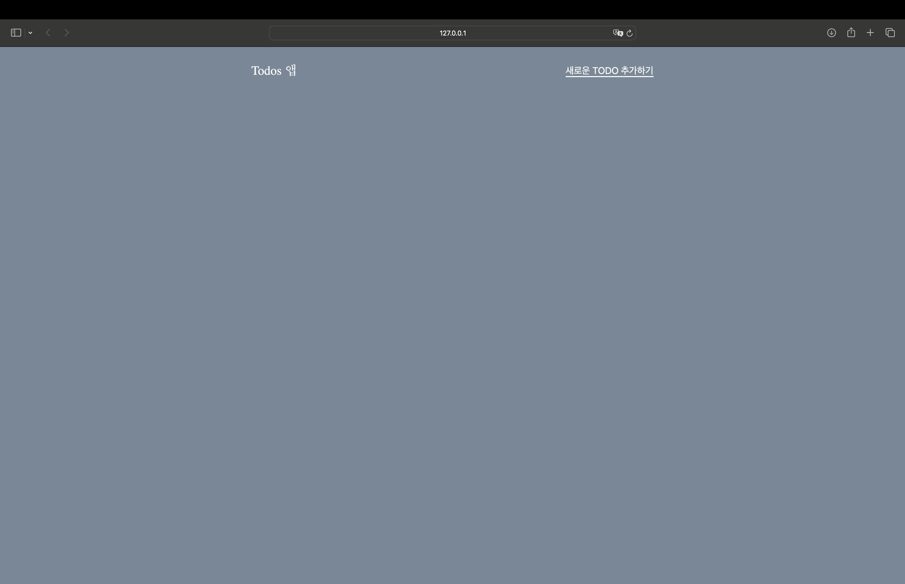
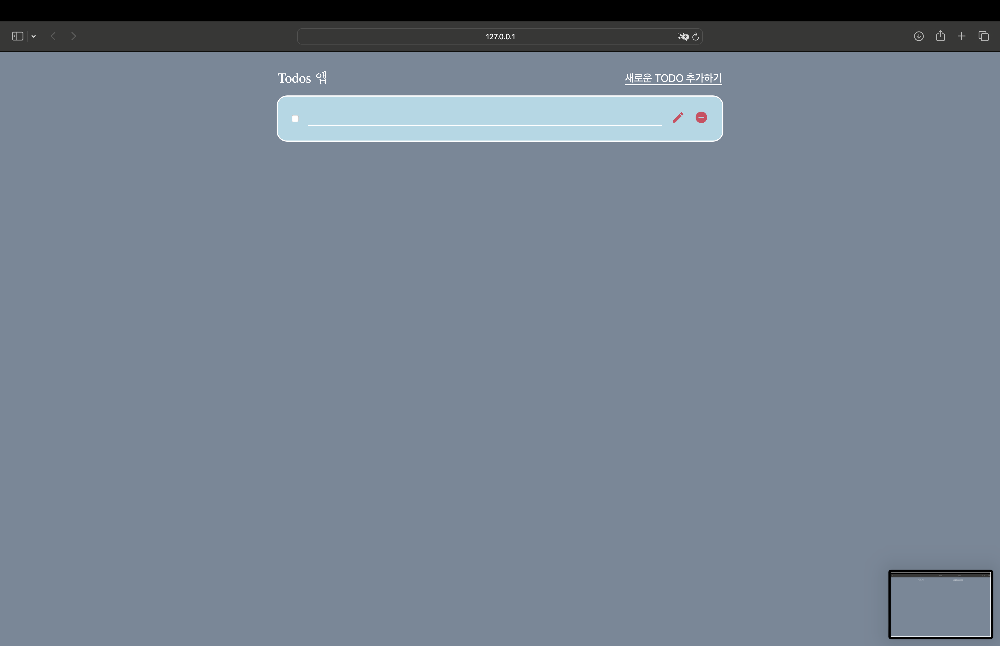
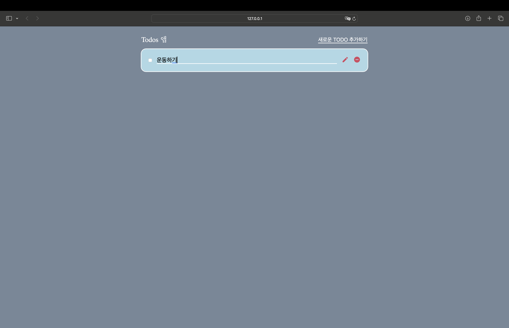
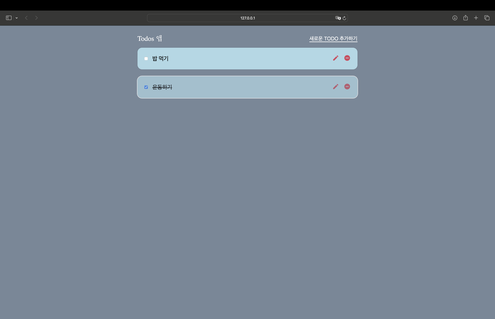

# 📝 Todo List App with JavaScript & LocalStorage

> 직관적이고 반응형인 Todo 앱입니다.  
> 자바스크립트 강의에서 배운 내용을 바탕으로,  
> 명확한 변수명과 함수 분리, 그리고 localStorage를 활용해  
> 새로고침해도 데이터가 유지됩니다.

---

## 🚀 주요 기능

- 할 일 추가, 수정, 삭제  
- 완료 상태 체크 및 해제  
- 로컬 저장소(localStorage)를 통한 데이터 지속성  
- 인풋 활성화 후 즉시 편집 가능  
- Material Icons 사용으로 직관적인 UI  

---

## 🎨 데모

> 

---

## 🛠 기술 스택

- HTML, CSS, JavaScript  
- [Google Material Icons](https://fonts.googleapis.com/icon?family=Material+Icons)  
- LocalStorage API  

---

## 📁 프로젝트 구조

```

/
├── index.html
├── style.css
└── script.js

```

---

## 🖥️ 화면 구성

- **헤더**  
  - 앱 제목(`Todos 앱`)
  - `새로운 TODO 추가하기` 버튼

- **할 일 목록 영역**  
  - 동적으로 생성되는 할 일 카드들  
  - 각 카드: 체크박스, 텍스트 입력, 수정/삭제 버튼(Material Icons 적용)

---

## ⚙️ 사용 방법

1. 저장소를 클론합니다.

```

git clone https://github.com/demian214/todo_project
cd js-todo-app

```

2. `index.html` 파일을 브라우저에서 엽니다.

3. **[새로운 TODO 추가하기]** 버튼을 클릭하여 할 일을 추가하세요.

4. 새 할 일 입력란에 내용을 입력하고, 포커스를 벗어나면 자동 저장됩니다.

5. 체크박스로 완료 상태를 토글할 수 있습니다.

6. ✏️ **edit** 버튼 클릭 시 편집 모드로 전환됩니다.

7. ❌ **remove_circle** 버튼 클릭 시 해당 할 일이 삭제됩니다.

8. 새로고침해도 데이터가 유지됩니다.

---

## 🧩 주요 코드 설계

- **명확한 변수명**  
`list`, `createBtn`, `todos`, `itemEl`, `inputEl`, `editBtnEl`, `removeBtnEl`

- **함수 분리**  
- `createNewTodo()` : 새 할 일 생성 및 화면 추가  
- `createTodoElment(item)` : 할 일 DOM 요소 생성 및 이벤트 연결  
- `displayTodos()` : 저장된 할 일 렌더링  
- `saveToLocalStorage()` : todos 배열 저장  
- `loadFromLocalStorage()` : todos 배열 불러오기  

- **localStorage 활용**  
JSON 문자열로 저장 및 불러오기

- **이벤트 핸들링**  
- 체크박스: 완료 상태 토글 및 스타일 변경  
- 텍스트 인풋: 입력 및 편집 저장  
- 수정 버튼: 편집 모드 진입  
- 삭제 버튼: 할 일 삭제  

---

## 💡 UI/UX 및 스타일링

- [Google Material Icons](https://fonts.googleapis.com/icon?family=Material+Icons) 사용  
- `edit` : 수정 버튼  
- `remove_circle` : 삭제 버튼  
- CSS로 카드형 UI, 중앙 정렬, 반응형 레이아웃 적용  
- 명확한 시각적 구분(완료시 스타일 변화 등)

---

## 📌 index.html 구조

```

<!DOCTYPE html>

<html lang="en">
<head>
    <meta charset="UTF-8">
    <meta name="viewport" content="width=device-width, initial-scale=1.0">
    <title>To Do</title>
    <link href="https://fonts.googleapis.com/icon?family=Material+Icons" rel="stylesheet">
    <link rel="stylesheet" href="style.css">
</head>
<body>
    <main>
        <div class="app">
            <header>
                <h1>Todos 앱</h1>
                <button id="create-btn">새로운 TODO 추가하기</button>
            </header>
            <div class="todo-list" id="list"></div>
        </div>
    </main>
    <script src="script.js"></script>
</body>
</html>
```

---

## 📌 예시 코드 스니펫 (JS)

```

const list = document.getElementById("list");
const createBtn = document.getElementById("create-btn");

let todos = [];

createBtn.addEventListener('click', createNewTodo);

function createNewTodo() {
const item = {
id : new Date().getTime(),
text : "",
complete : false
}
todos.unshift(item);
const { itemEl, inputEl } = createTodoElment(item);
list.prepend(itemEl);
inputEl.removeAttribute("disabled");
inputEl.focus();
saveToLocalStorage();
}

// ... 이하 생략 ...

```

---

## 🤝 기여 방법

1. 저장소를 포크합니다.  
2. 새 브랜치를 생성합니다.  
3. 변경 사항을 커밋합니다.  
4. Pull Request를 보냅니다.

---

## 💬 피드백

> README와 스크린샷 등 프로젝트 설명 자료를 꼼꼼히 준비하신 점이 정말 인상적입니다!
> html, css, js 파일 분리 등 기본기도 훌륭합니다.
>
> **더 세련된 프로젝트를 위해**
> - 폴더 구조 정리(`css/`, `js/`, `assets/` 등)
> - `.gitignore` 파일로 불필요한 시스템 파일 제외
> - 시맨틱 태그, 명확한 클래스명, 함수 분리 등 코드 스타일 개선
>
> 이런 점을 더 신경 쓰면 더욱 완성도 높은 프로젝트가 될 거예요!

---

## ⚙️ 업데이트 내역

- 피드백 리드미에 반영 - 2025.06.14 | 17:50

---

## 📄 라이선스

MIT

---

> **참고:**  
> 이 README는 자바스크립트 강의에서 배운 내용을 바탕으로,  
> 단순성과 가독성, 유지보수를 고려하여 작성되었습니다.  
> 추가 기능(예: 완료 표시, 우선순위 등)은 자유롭게 확장 가능합니다.
